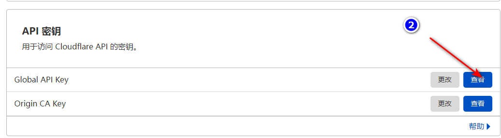
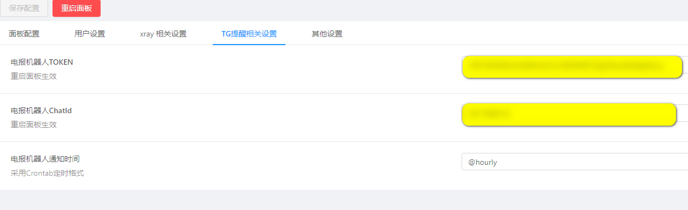
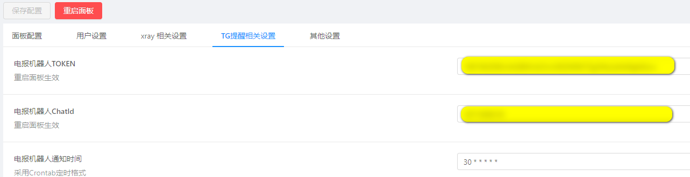

# M-UI

现代化、高级的多协议多用户 xray 面板

<p align="center">
  
  
  
</p>

<p align="center">
  <b>全新现代化UI设计 | 高级功能 | 极致体验</b>
</p>

# 🌟 核心特性

### 🎨 现代化UI设计
- 全新现代化界面，美观大方
- 响应式设计，适配各种设备
- 流畅的动画效果和交互体验
- 深色模式支持

### 🔧 强大功能
- **多协议支持**：vmess、vless、trojan、shadowsocks、dokodemo-door、socks、http
- **系统监控**：实时监控CPU、内存、硬盘、网络等系统资源
- **流量控制**：精确的流量统计和限制功能
- **用户管理**：多用户支持，独立配置
- **安全访问**：支持HTTPS访问面板
- **SSL证书**：一键申请和自动续签SSL证书
- **TG机器人**：实时通知和提醒功能

### ⚡ 高性能
- 基于Go语言开发，高性能低资源占用
- 优化的xray内核配置
- 支持高并发连接

# 安装&升级

```
bash <(curl -Ls https://raw.githubusercontent.com/imaicai/m-ui/master/install.sh)
```

## 🛠️ 手动安装

1. 从 [Releases](https://github.com/imaicai/m-ui/releases) 下载最新的压缩包，一般选择 `amd64`架构
2. 将压缩包上传到服务器的 `/root/`目录下，并使用 `root`用户登录服务器

> 如果你的服务器 CPU 架构不是 `amd64`，请将命令中的 `amd64`替换为相应架构

```bash
cd /root/
rm m-ui/ /usr/local/m-ui/ /usr/bin/m-ui -rf
tar zxvf m-ui-linux-amd64.tar.gz
chmod +x m-ui/m-ui m-ui/bin/xray-linux-* m-ui/m-ui.sh
cp m-ui/m-ui.sh /usr/bin/m-ui
cp -f m-ui/m-ui.service /etc/systemd/system/
mv m-ui/ /usr/local/
systemctl daemon-reload
systemctl enable m-ui
systemctl restart m-ui
```

## 使用docker安装

> 此 docker 教程与 docker 镜像由[Chasing66](https://github.com/Chasing66)提供

1. 安装docker

```shell
curl -fsSL https://get.docker.com | sh
```

2. 安装x-ui

```shell
mkdir m-ui && cd m-ui
docker run -itd --network=host \
    -v $PWD/db/:/etc/m-ui/ \
    -v $PWD/cert/:/root/cert/ \
    --name m-ui --restart=unless-stopped \
    imaicai/m-ui:latest
```

> Build 自己的镜像

```

```

## SSL证书申请

> 此功能与教程由[FranzKafkaYu](https://github.com/FranzKafkaYu)提供

脚本内置SSL证书申请功能，使用该脚本申请证书，需满足以下条件:

- 知晓Cloudflare 注册邮箱
- 知晓Cloudflare Global API Key
- 域名已通过cloudflare进行解析到当前服务器

获取Cloudflare Global API Key的方法:
    
    

使用时只需输入 `域名`, `邮箱`, `API KEY`即可，示意图如下：
        

注意事项:

- 该脚本使用DNS API进行证书申请
- 默认使用Let'sEncrypt作为CA方
- 证书安装目录为/root/cert目录
- 本脚本申请证书均为泛域名证书

## Tg机器人使用（开发中，暂不可使用）

> 此功能与教程由[FranzKafkaYu](https://github.com/FranzKafkaYu)提供

X-UI支持通过Tg机器人实现每日流量通知，面板登录提醒等功能，使用Tg机器人，需要自行申请
具体申请教程可以参考[博客链接](https://coderfan.net/how-to-use-telegram-bot-to-alarm-you-when-someone-login-into-your-vps.html)
使用说明:在面板后台设置机器人相关参数，具体包括

- Tg机器人Token
- Tg机器人ChatId
- Tg机器人周期运行时间，采用crontab语法  

参考语法：
- 30 * * * * * //每一分的第30s进行通知
- @hourly      //每小时通知
- @daily       //每天通知（凌晨零点整）
- @every 8h    //每8小时通知  

TG通知内容：
- 节点流量使用
- 面板登录提醒
- 节点到期提醒
- 流量预警提醒  

更多功能规划中...
## 建议系统

- CentOS 7+
- Ubuntu 16+
- Debian 8+

# 📸 界面预览





# 📚 常见问题

## 从 v2-ui 迁移

首先在安装了 v2-ui 的服务器上安装最新版 M-UI，然后使用以下命令进行迁移：

```bash
m-ui v2-ui
```

> 迁移成功后请关闭 v2-ui 并重启 M-UI

## 面板访问

默认端口：`54321`
默认用户名：`admin`
默认密码：`admin`

建议安装后立即修改默认用户名和密码！

# 📜 许可证

[GPL-3.0](LICENSE)

# ❤️ 致谢

- [xray-core](https://github.com/xtls/xray-core)
- [vaxilu/x-ui](https://github.com/vaxilu/x-ui)
- [Chasing66](https://github.com/Chasing66)
- [FranzKafkaYu](https://github.com/FranzKafkaYu)
